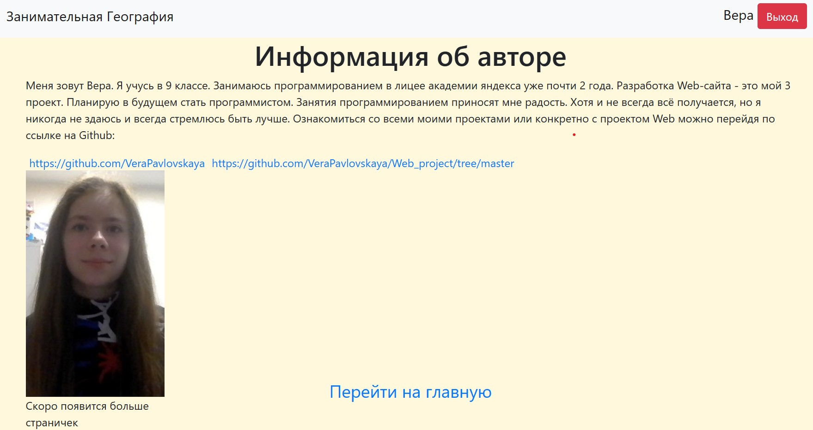

Geo_Core - географический сайт с необычным функционалом.





На главной странице присутствует панель, стиль которой сделан с использованием компонентов bootstrap, 
при нажатии на каждую ссылку, пользователь переходит на соответствующую страничку. 
При нажатии на ссылку с названием "Контурные карты", открывается страничка с контурными картами,
которые можно скачать на комрьютер пользователя. Эта функция реализована с помощью метода "download" в файле index.html
На страничке "Географические определения" можно найти массу полезных географических определений.
Они все прописаны в definitions.html. Ссылка "Инфориация об авторе" ведёт на страничку с инфориацией о разработчике сайта.
Часто пользователям интерестно почитать про авторов сайтов. Для этого создан about_me.html.
Многим захочится увидеть больше функций на моём сайте, поэтому я создала страничку о будущих дороботках сайта,
чтобы пользователи понимали, какие изменения их ждут в будущем. Этому способствует future_works.html


 Приложение написано на языке программирования **python**, используются каскадные таблицы стилей **css**
 также используется язык гипертекстовой разметки **HTML**. Использовались компоненты bootstrap такие как: 
 навигационные ссылки, горизонтальные разделители, 
 
Общий алгоритм пользования сайтом состоит в следующем:
  - открыть главное окно и нажать на кнопку зарегестрироваться/войти
  - переходить по ссылкам предложенным в панели.
  - Присутствует возможность загружать изображения, читать и учить предложенные определения

В будущем так же планируется предусмотрение возможности получать пожелания от пользователей по поводу дороботок. Эти данные будут отображаться в базе данных.


| Каталог   | Предназначение                                                      |
|-----------|---------------------------------------------------------------------|
| images    | для хранения картинок, используемых readme и technicalspecificftion |
| static    | для второстеренных подкотологов (css)                               |
| css       | для стиля сайта                                                     |
| templates | для хранения шаблонов написанных на HTML                            |
| forms     | для реализации авторизации и входа пользователя                     |

Ссылки на источники:
    1.Учебник лицея академии яндекса
    2.https://www.w3schools.com/html/html_css.asp - работа со стилями в style.css
    3. https://getbootstrap.com/ - компоненты bootstrap
    4. https://quizlet.com/21350796/flashcards - географические определения
    5. https://github.com/VeraPavlovskaya/Web_project/tree/master - ссылка на проект в гитхабе

Для запуска приложения с исползованием интерпретатора python рекомендуется использовать использовать python3.10.
Предварительно необходимо установить все внешние библиотеки.
```sh
$ pip install -r requirements.txt
```
